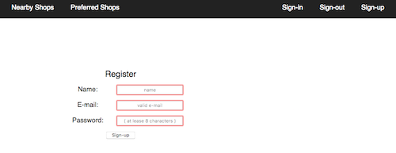
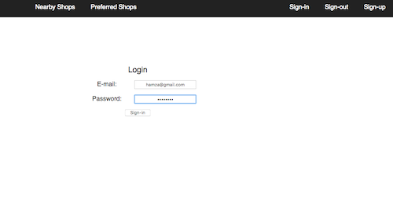
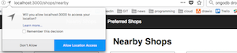
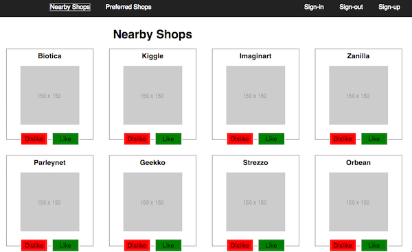
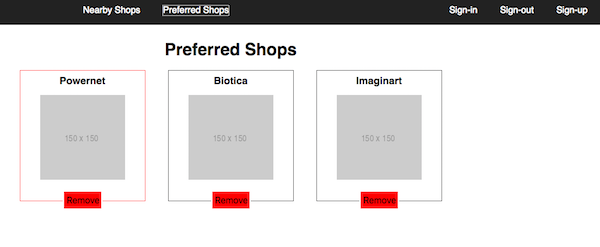

This is a Full-Stack web coding challenge.
( https://github.com/hiddenfounders/web-coding-challenge/blob/master/README.md )
## Idea of the app
The task is to implement an app that lists shops nearby.

## Features
- As a User, I can sign up using my email & password
- As a User, I can sign in using my email & password
- As a User, I can display the list of shops sorted by distance
- As a User, I can like a shop, so it can be added to my preferred shops
  - Acceptance criteria: liked shops shouldn’t be displayed on the main page
- As a User, I can dislike a shop, so it won’t be displayed within “Nearby Shops” list during the next 2 hours
- As a User, I can display the list of preferred shops
- As a User, I can remove a shop from my preferred shops list

## Technologies used
- Backend: Express JS
- Frontend: React

## Folder structure
- The backend folder contains the Express JS app
- The frontend folder contains the React app

## Steps to install
- Clone the current repository : ```git clone https://github.com/hamzafox/shops-web-coding-challenge.git```
- Install MongoDB if needed
- navigate to the backend directory, and create the DB :
```mongorestore --db shops_dev_db shops/```
- start Mongo and in the shell create the index for geolocalisation : ```db.shops.createIndex({location: "2dsphere"})```
- ( You may want to do the same thing for the test DB , the names of the DBs must match the names in the config file : ./backend/app/config/db.js)
- navigate to the backend directory and run ```npm install```
- then run ```npm start```

- Navigate to the ./frontend directory and do the same: ```npm install```, then ```npm start```

- By default the backend app runs at localhost:8080
- By default the frontend app runs at localhost:3000
- A proxy is setup in the package.json of the frontend app to route the requests.

## Screenshots
- Register :



- Sign-in :



- Get shops sorted by geolocalisation:



- List nearby shops:



Add and Remove shops from preferred shops list:


